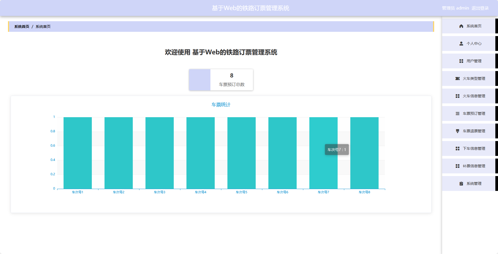
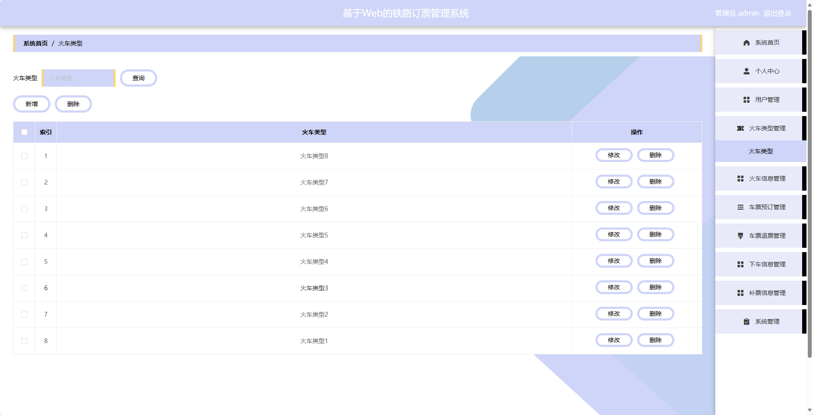
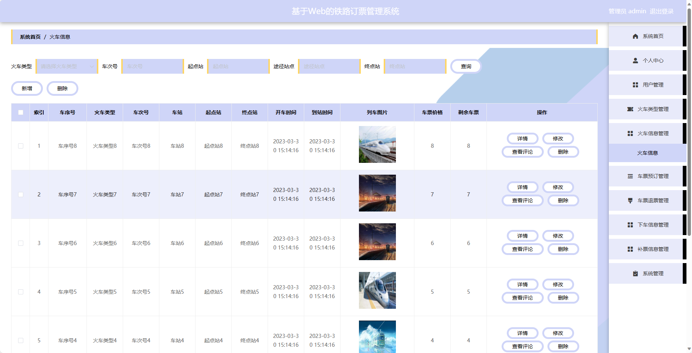
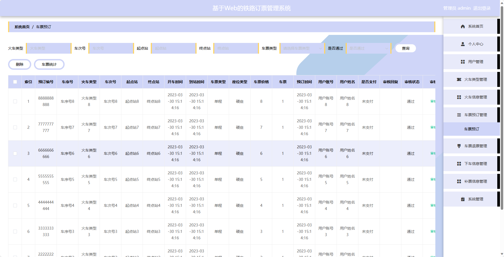
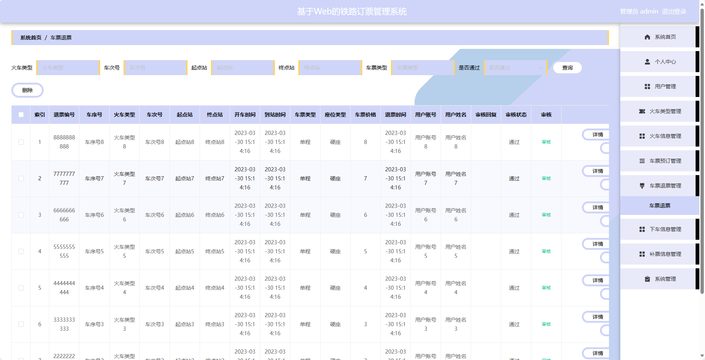
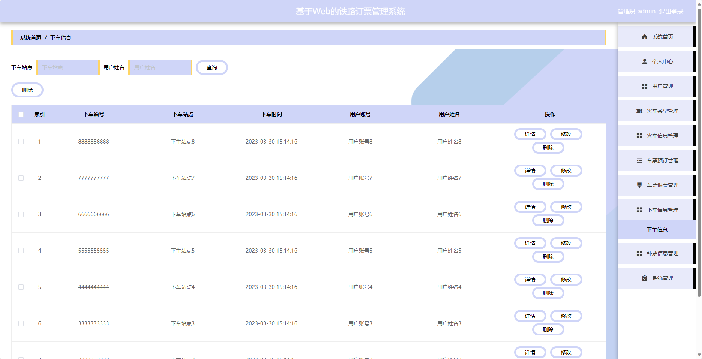
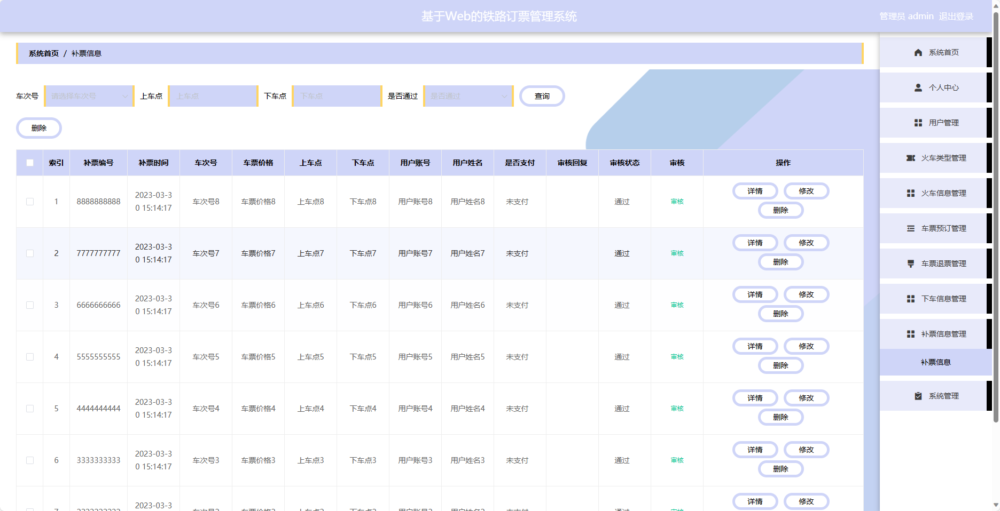
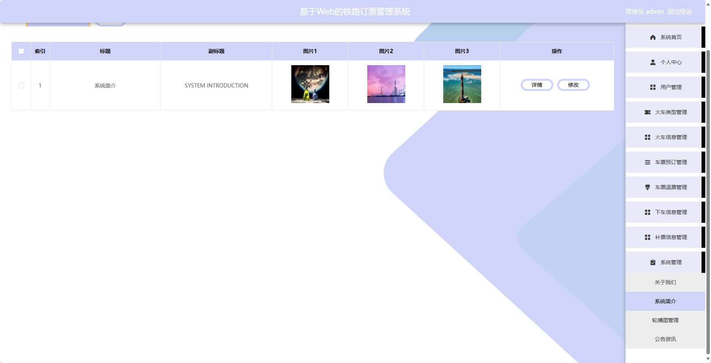

基于SpringBoot的铁路订票管理系统
=
- 完整代码获取地址：从戎源码网 ([https://armycodes.com/](https://armycodes.com/))
- 作者微信：19941326836  QQ：952045282 
- 承接计算机毕业设计、Java毕业设计、Python毕业设计、深度学习、机器学习
- 选题+开题报告+任务书+程序定制+安装调试+论文+答辩ppt 一条龙服务
- 所有选题地址https://github.com/nature924/allProject

一、项目介绍
---
基于Spring Boot框架实现的铁路订票管理系统，系统包含两种角色：管理员、用户,系统分为前台和后台两大模块，主要功能如下。

### 前台：

1. 首页：展示最新公告、火车信息等。
2. 火车信息：展示火车时刻表、票价等信息。
3. 公告资讯：展示最新的通知、公告等信息。
4. 个人中心：用户可以管理个人信息，包括修改密码、查看订单历史等操作。

### 后台：

1. 管理员个人中心：管理员可以管理个人信息，包括修改密码等操作。
2. 用户管理：管理员可以管理用户信息，包括查看用户列表、禁用用户等操作。
3. 火车类型管理：管理员可以管理火车的类型信息，包括添加、编辑、删除等操作。
4. 火车信息管理：管理员可以管理火车的具体信息，包括添加、编辑、删除等操作。
5. 车票预订管理：管理员可以查看用户的订票信息，包括审核、取消等操作。
6. 车票退票管理：管理员可以处理用户的退票申请，包括审核、处理等操作。
7. 下车信息管理：管理员可以查看用户的下车信息，包括审核、处理等操作。
8. 补票信息管理：管理员可以处理用户的补票申请，包括审核、处理等操作。
9. 系统管理：管理员可以管理系统的参数设置、日志查看等功能。

### 用户：

1. 个人中心：用户可以管理个人信息，包括修改密码、查看订单历史等操作。
2. 车票预订管理：用户可以查询车次信息，选择座位并进行订票操作。
3. 车票退票管理：用户可以申请退订车票，进行退票操作。
4. 下车信息管理：用户可以填写下车信息，如下车时间、下车地点等。
5. 补票信息管理：用户可以填写补票信息，如车票遗失补办等。

二、项目技术
---
- 编程语言：Java
- 数据库：MySQL
- 项目管理工具：Maven
- 前端技术：VUE、HTML、Jquery、Bootstrap
- 后端技术：Spring、SpringMVC、MyBatis

三、运行环境
---
- 操作系统：Windows、macOS都可以
- JDK版本：JDK1.8以上都可以
- 开发工具：IDEA、Ecplise、Myecplise都可以
- 数据库: MySQL5.7以上都可以
- Tomcat：任意版本都可以
- Maven：任意版本都可以

四、运行截图
---

### 程序截图：

